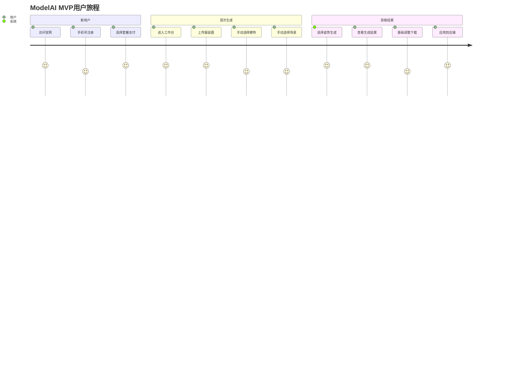

> **文档版本**: V1.1 (轻量MVP版)
>
> **创建日期**: 2024年1月
>
> **产品名称**: ModelAI
>
> **核心定位**: 轻量、易用、快速上线的电商模特生成MVP
>
> **目标读者**: 产品、设计、开发、测试团队
>

## 1. 产品概述
### 1.1 产品定位调整
**聚焦核心价值**：为中小电商企业提供最简单、最快速的服装模特图生成服务，让用户"上传服装图 → 选择模特场景 → 获得商用图片"三步完成。

### 1.2 核心价值主张（简化版）
+ **对用户**：10分钟内完成原本需要3天、花费数万元的模特拍摄
+ **对团队**：最小可行产品，2个月内上线验证市场
+ **对技术**：轻量架构，快速迭代，降低试错成本

### 1.3 目标用户画像（聚焦）
| 用户类型 | 核心痛点 | 期望解决方案 |
| --- | --- | --- |
| **淘宝/拼多多中小店主**   (1-5人团队) | 预算有限，无法承担模特拍摄 | 百元内生成一套商品图 |
| **电商运营个人** | 商品上新急，素材需求大 | 快速批量生成主图 |
| **初创服装品牌** | 需要测试市场反应 | 低成本制作多风格展示图 |


## 2. 产品功能需求（简化版）
### 2.1 核心功能模块（仅保留MVP必需功能）
#### 2.1.1 极简用户系统
**核心目标**：让用户最快开始使用

+ **注册登录**：
    - 手机号验证码注册/登录
    - 企业信息（名称、联系人）非必填
    - 立即使用，无需审核
+ **权限管理**（极度简化）：
    - 仅两种角色：管理员、编辑员
    - 管理员：可管理团队、查看账单
    - 编辑员：仅能使用生成功能
+ **计费系统**：
    - 按次充值模式，非订阅制
    - 套餐：体验包（9.9元/10张）、基础包（99元/200张）
    - 微信/支付宝直接支付

#### 2.1.2 基础素材管理
**核心目标**：让用户能快速找到所需素材

+ **预设素材库**（平台提供）：
    - 模特库：20个基础模特（10女/5男/5童），按性别分类
    - 场景库：10个常用场景（纯白/纯灰/咖啡店/街拍/室内）
    - 姿势库：5个基础姿势（正面站/侧面站/坐姿/行走/细节展示）
+ **用户私有素材**：
    - 服装图上传：支持拖拽，最多10张批量
    - 基础管理：列表查看、删除、重命名
    - 自动裁剪：上传后自动裁剪为正方形

#### 2.1.3 核心生成工作流
**设计原则**：手动选择 > AI推荐，用户完全控制

**单张生成流程**：

```plain
步骤1：上传服装图
  ↓
步骤2：手动选择模特（性别→选择具体模特）
  ↓
步骤3：手动选择场景（分类→选择具体场景）
  ↓
步骤4：手动选择姿势（从5个基础姿势选择）
  ↓
步骤5：一键生成（默认参数，无高级设置）
  ↓
步骤6：查看结果，满意则保存/下载
```

**批量生成流程**：

```plain
步骤1：批量上传最多10张服装图
  ↓
步骤2：统一配置（一套模特+场景+姿势应用于所有）
  ↓
步骤3：批量生成（队列处理，进度显示）
  ↓
步骤4：分张查看，选择性下载
```

#### 2.1.4 基础图片处理
**仅保留最必要功能**：

+ **生成后基础调整**：
    - 裁剪为平台尺寸：淘宝主图（800×800）、详情页（750×不限）
+ **下载管理**：
    - 单张下载（原图/裁剪后）
    - 批量下载ZIP包
    - 最近10次生成历史查看

### 2.2 功能优先级矩阵（调整后）
| 功能模块 | MVP版本 (6-8周) | 第2阶段 (3-4周) | 第3阶段 (2-3周) |
| --- | --- | --- | --- |
| **用户系统** | 手机号登录、按次支付 | 企业认证、发票申请 | 会员订阅制 |
| **素材管理** | 预设模特/场景库、服装上传 | 素材分类搜索 | 用户收藏夹 |
| **生成流程** | 手动选择三要素、单张/批量生成 | 快速模板（组合保存） | 智能推荐（可选） |
| **图片处理** | 平台尺寸裁剪 | 水印添加 | 批量重命名 |
| **管理后台** | 用户管理、生成记录查看 | 数据统计面板 | 内容审核后台 |


### 2.3 用户旅程（简化版）


## 3. 非功能需求（保持核心）
### 3.1 性能需求
+ **生成速度**：单张 ≤ 30秒（从点击生成到出图）
+ **页面加载**：首屏 < 2秒
+ **并发支持**：50用户同时在线
+ **可用性**：99% 以上

### 3.2 质量基准
+ **输出分辨率**：1024×1024（最低保证）
+ **服装还原度**：图案、颜色基本准确
+ **人脸自然度**：无明显畸形
+ **商用底线**：可直接用于淘宝/拼多多主图

### 3.3 安全与合规
+ **内容安全**：必须集成国内审核API
+ **数据加密**：用户图片传输加密
+ **备案要求**：必须完成ICP备案

## 4. 技术架构（轻量版）
### 4.1 整体架构简化
```plain
前端（React） → 后端（FastAPI） → AI服务（国内API）
                     ↓              ↓
                 数据库        文件存储
                (MongoDB)     (阿里云OSS)
```

### 4.2 核心服务简化设计
```python
# 极度简化的生成服务
class SimpleGenerationService:
    def generate_simple(
        self, 
        garment_image: str,  # 服装图URL
        model_id: str,       # 选择的模特ID
        scene_id: str,       # 选择的场景ID
        pose_id: str         # 选择的姿势ID
    ) -> str:  # 返回生成图URL
        
        # 1. 构建最简单提示词
        prompt = self._build_simple_prompt(model_id, scene_id, pose_id)
        
        # 2. 调用国内AI API（字节/百度）
        result = self._call_ai_api(prompt, garment_image)
        
        # 3. 基础后处理
        processed = self._basic_postprocess(result)
        
        return processed
    
    def _build_simple_prompt(self, model_id, scene_id, pose_id):
        """构建最简单提示词"""
        # 从数据库获取描述
        model_desc = db.get_model_desc(model_id)  # 如"亚洲年轻女性"
        scene_desc = db.get_scene_desc(scene_id)  # 如"纯白背景摄影棚"
        pose_desc = db.get_pose_desc(pose_id)     # 如"正面站立姿势"
        
        return f"{model_desc}穿着此服装,{scene_desc},{pose_desc},电商产品图,高清,专业摄影"
```

### 4.3 数据库设计（简化）
```sql
-- 极度简化的核心表
CREATE TABLE users (
    id UUID PRIMARY KEY,
    phone VARCHAR(20) UNIQUE,
    balance INT DEFAULT 0,  -- 剩余生成次数
    created_at TIMESTAMP
);

CREATE TABLE generation_tasks (
    id UUID PRIMARY KEY,
    user_id UUID REFERENCES users(id),
    garment_url TEXT,
    model_id VARCHAR(50),
    scene_id VARCHAR(50),
    result_url TEXT,
    status VARCHAR(20),
    created_at TIMESTAMP
);

CREATE TABLE preset_models (
    id VARCHAR(50) PRIMARY KEY,
    name VARCHAR(50),
    gender VARCHAR(10),
    preview_url TEXT
);
-- 同理preset_scenes, preset_poses
```

## 5. 部署方案（轻量快速）
### 5.1 最小化部署架构
```plain
# docker-compose.yml (仅3个服务)
version: '3.8'

services:
  # 前端 - 静态网站
  frontend:
    build: ./frontend
    ports: ["80:80"]
  
  # 后端 - 所有功能在一个服务
  backend:
    build: ./backend
    ports: ["8000:8000"]
    environment:
      - MONGODB_URL=mongodb://mongo:27017/modelai
      - OSS_ENDPOINT=oss-cn-hangzhou.aliyuncs.com
    depends_on:
      - mongo
  
  # 数据库
  mongo:
    image: mongo:6
    volumes:
      - mongo_data:/data/db

volumes:
  mongo_data:
```

### 5.2 简化部署流程
```bash
# 部署脚本（一键部署）
#!/bin/bash
# 1. 拉取代码
git pull origin main

# 2. 构建镜像
docker-compose build

# 3. 启动服务
docker-compose up -d

# 4. 健康检查
curl http://localhost:8000/health || echo "启动失败"
```

## 6. 实施路线图（8周MVP）
### 第1-2周：基础框架
+ 前端：React基础框架 + 登录页面
+ 后端：FastAPI基础框架 + 用户系统
+ 部署：Docker化，国内服务器部署

**交付**：可访问的登录页面，手机号注册登录

### 第3-4周：核心功能
+ 素材管理：20个模特+10个场景+5个姿势
+ 图片上传：服装图上传和管理
+ 基础UI：生成工作台布局

**交付**：可上传图片，可选择素材的工作台

### 第5-6周：AI集成
+ AI服务：集成字节/百度AI API
+ 生成流程：完整单张生成流程
+ 支付系统：微信支付集成

**交付**：可完成一次付费生成全流程

### 第7-8周：优化上线
+ 批量生成功能
+ 基础图片调整工具
+ 性能优化和测试
+ 正式上线推广

**交付**：可公开使用的MVP产品，第一批种子用户

## 7. 成功指标（MVP阶段）
### 7.1 MVP验证指标
| 指标 | 目标值 | 说明 |
| --- | --- | --- |
| 周活跃用户 | > 50人 | 验证有真实需求 |
| 付费转化率 | > 5% | 验证付费意愿 |
| 用户留存率 | 周留存 > 20% | 验证产品可用性 |
| 平均生成次数 | > 3次/人 | 验证实用性 |
| 用户满意度 | NPS > 20 | 问卷调研 |


### 7.2 技术健康指标
| 指标 | 预警线 | 处理时间 |
| --- | --- | --- |
| 生成失败率 | > 10% | 2小时内 |
| API响应时间 | > 5秒 | 1小时内 |
| 服务器负载 | CPU > 80% | 30分钟内 |


## 8. 风险控制（聚焦MVP）
### 8.1 技术风险
+ **AI生成质量不稳定**
    - 应对：选择最稳定的国内API，准备1个备用供应商
    - 接受度：MVP阶段允许一定失败率（<20%）
+ **并发性能不足**
    - 应对：队列处理，超过10个任务时排队
    - 可接受：非实时生成，用户可等待

### 8.2 业务风险
+ **用户不愿付费**
    - 应对：9.9元体验包降低门槛
    - 测试：免费额度邀请测试，收集反馈
+ **生成效果不达预期**
    - 应对：明确说明"AI辅助工具，非专业拍摄"
    - 定位：补充工具，非完全替代

## 9. 资源需求（最小化）
### 9.1 人员需求
| 角色 | 人力 | 周期 | 主要职责 |
| --- | --- | --- | --- |
| 全栈开发 | 1人 | 全职8周 | 前后端开发、部署 |
| 产品/设计 | 0.5人 | 兼职 | 产品设计、用户调研 |
| 测试 | 0.5人 | 最后2周 | 功能测试、用户体验 |


### 9.2 成本预算（8周）
| 项目 | 费用 | 说明 |
| --- | --- | --- |
| 云服务器 | 1,500元 | 2核4G，按量付费 |
| AI API调用 | 2,000元 | 按实际使用，预估 |
| 对象存储 | 300元 | 阿里云OSS |
| 域名备案 | 免费 | 自有域名 |
| **总计** | **≤ 4,000元** | 可控范围内 |


## 10. 关键决策点
### 10.1 MVP上线前必须完成
- [ ] 单张生成全流程跑通（从上传到下载）
- [ ] 支付系统可正常使用
- [ ] 内容安全审核集成
- [ ] 基础性能测试通过
- [ ] 10个种子用户内测反馈

### 10.2 可延后功能（明确暂缓）
1. ❌ AI智能推荐（全部手动选择）
2. ❌ 高级图片编辑工具
3. ❌ 复杂的团队权限管理
4. ❌ 智能标签和数据分析
5. ❌ 多模型对比和选择

### 10.3 MVP成功标准
+ **技术成功**：系统稳定运行，生成成功率>80%
+ **产品成功**：用户完成"上传-选择-生成-下载"全流程
+ **商业成功**：有用户愿意为生成次数付费
+ **迭代基础**：收集到明确的用户反馈和改进建议

## 11. 附录
### 11.1 MVP功能清单
```plain
✓ 用户系统
  - 手机号登录
  - 余额管理
  - 生成记录查看

✓ 素材管理
  - 20个预设模特
  - 10个预设场景  
  - 5个预设姿势
  - 服装图上传/管理

✓ 生成功能
  - 单张生成（手动选择三要素）
  - 批量生成（统一配置）
  - 平台尺寸裁剪

✓ 管理后台
  - 用户管理
  - 生成记录查询
  - 余额管理
```

### 11.2 技术栈确认
+ 前端：React 18 + TypeScript + Ant Design Mobile
+ 后端：FastAPI + Python 3.10
+ 数据库：MongoDB Atlas（免费版）
+ 文件存储：阿里云OSS
+ AI服务：字节跳动Doubao API（主）+ 百度文心一格（备）
+ 部署：阿里云ECS + Docker
+ 监控：基础云监控 + 日志文件

### 11.3 时间计划表
```plain
第1-2周：基础框架搭建
第3-4周：核心功能开发  
第5-6周：AI集成测试
第7周：内部测试优化
第8周：上线推广
```

---

**文档状态**：✅ 轻量MVP版定稿  
**核心原则**：少即是多，快速验证  
**下一步行动**：立即启动第1-2周开发工作  

**修订说明**：

+ 删除所有非核心复杂功能
+ 聚焦"手动选择+一键生成"核心流程
+ 技术架构极度简化
+ 8周明确上线计划
+ 4000元预算可控范围

---

#### 行业竞品
1. [Botika](https://botika.io/?utm_term=botika+ai&utm_campaign=Botika+-+Submit+Leads+Campaign&utm_source=adwords&utm_medium=ppc&hsa_acc=1484567603&hsa_cam=20983256328&hsa_grp=165930798445&hsa_ad=713868704099&hsa_src=g&hsa_tgt=kwd-2338093622830&hsa_kw=botika+ai&hsa_mt=p&hsa_net=adwords&hsa_ver=3&wpsrc=Google+AdWords&wpcid=21702482349&wpscid=165930798445&wpcrid=713868704099&wpkwid=kwd-2338093622830&wpkwn=botika+ai&wpkmatch=p&wpsnetn=g&gad_source=1&gclid=CjwKCAjwnPS-BhBxEiwAZjMF0tHqEUZoaUvLkwICnxmAHOd4N4svQQKN1db2yS6K9nHSLda1ZJ9kgxoCuiwQAvD_BwE)：最匹配的服装电商图生成流程和工具；[融资新闻](https://www.bigbigai.com/wiki/trends/7870.html)
2. [阿里-绘蛙](https://www.ihuiwa.com/)
3. [modelia.ai](https://modelia.ai/)：各种AI图片工具
4. [Picjam](https://www.picjam.ai/)：偏图片和视频AI编辑生成工具
5. [Uwear](https://uwear.ai/)：模特图片和视频生成工具
6. [SellerPic](https://app.sellerpic.ai/)：各种AI图片工具
7. [Dreamshot](https://dreamshot.io/ai-backgrounds)：制作AI模特和背景；
8. [电商文生图研究报告](https://gemini.google.com/app/af1f01c9c1b64bb0?utm_source=app_launcher&utm_medium=owned&utm_campaign=base_all)

